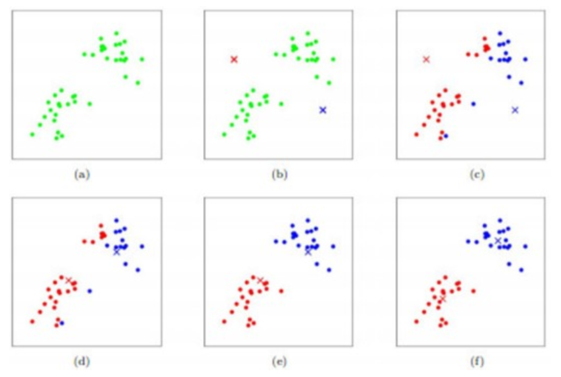

# BasicModels

## 线性回归（Linear Regression）

回归目的是使预测值尽可能接近真实值。

线性回归指的是给定输入的特征向量 x，学习一组参数 w、b，使用线性计算得到预测值 y'，即 $y'=w\times x+b$，使 y' 尽可能接近真实值 y。

线性回归分为 2 类：

- 一元线性回归：`y=w*x+b`，`x.shape=(1,)`，`y.shape=(1, )`，x 和 y 一一对应，计算标量 w 值和标量 b 值
- 多元线性回归：`y=w[0]*x[0]+w[1]*x[1]+w[2]*x[2]+...+w[n-1]*x[n]+b`，`x.shape=(n,)`，`y.shape=(1, )`，n个输入值组成的向量 x 对应 1 个 y 值，计算向量 w 和标量 b 值

损失函数使用最小二乘法：
$$
c = \frac{\sum_1^{m} (y'-y)^2}{2m}
$$
上述公式中样本数为 m

使用梯度下降法进行优化

一元线性回归代码如下：

```python
import tensorflow as tf
import numpy as np
import matplotlib.pyplot as plt

# 定义参数
learning_rate = 0.01
training_epochs = 500

# 建立训练数据
x = np.array([3.3,4.4,5.5,6.71,6.93,4.168,9.779,6.182,7.59,2.167,7.042,10.791,5.313,7.997,5.654,9.27,3.1], dtype=np.float32)
y = np.array([1.7,2.76,2.09,3.19,1.694,1.573,3.366,2.596,2.53,1.221,2.827,3.465,1.65,2.904,2.42,2.94,1.3], dtype=np.float32)

# 建立tf.placeholder
X = tf.placeholder(dtype=tf.float32)  # 默认shape参数值为None，表示shape完全由使用时的feed_dict参数决定
Y = tf.placeholder(dtype=tf.float32)  # 默认shape参数值为None，表示shape完全由使用时的feed_dict参数决定

# 建立tf变量
w = tf.Variable(np.random.randn(), name="weight")  # 标量
b = tf.Variable(np.random.randn(), name="bias")  # 标量

# 计算结果
Y_ = tf.add(tf.multiply(X, w), b)  # multiply和add计算支持broadcasting，使得标量w/a与X的每个元素相乘/相加

# 损失函数
cost = tf.reduce_sum(tf.pow((Y_-Y), 2))/x.shape[0]  # 用除以x.shape[0]实现归一化

# 定义优化器
optimizer = tf.train.GradientDescentOptimizer(learning_rate).minimize(cost)

# 训练
with tf.Session() as sess:
	# 变量初始化
	sess.run(tf.global_variables_initializer())

	# 训练循环
	# 2种方法：1次优化使用全部训练数据；1次优化使用训练数据中的一组
	for i in range(training_epochs):
		# 训练方法1：
		# feed_dict的向shape为None的placeholder送入数据，placeholder的shape即为参数shape
		sess.run(optimizer, feed_dict={X: x, Y: y})
		# 训练方法2：
		# for xx, yy in zip(x, y):
		# 	sess.run(optimizer, feed_dict={X: xx, Y: yy})

	print("finished training")

	# 显示图像
	plt.plot(x, y, "ro", label="training data")
	plt.plot(x, sess.run(w)*x+sess.run(b), label="fitted")
	plt.legend()
	plt.show()

```

## 逻辑回归（Logistic Regression）

逻辑回归用于解决二分类问题，需要一个映射函数，将分类结果映射成为 [0, 1] 之间的概率值，并且该函数具有很好的可微分性。

在二分类问题上，sigmoid 函数满足上述条件：
$$
y'=g(z)=\frac{1}{1+e^{-z}}
$$
仿照线性回归公式，z值计算方法：`z=w[0]*x[0]+w[1]*x[1]+w[2]*x[2]+...+w[n-1]*x[n-1]+b`

对于 m 种类别的分类，每个类别都计算得到对应 1 个 z 值，即对应 1 个预测值 y'

设样本输入值 x.shape=(None, n)：None 维度表示样本数目，n 表示每个样本的数值个数，则有

样本输出值 y.shape=(None, m)

权重 w.shape=(n, m)，偏置 b.shape=(m, )，预测值 y'.shape=(None, m)

损失函数使用交叉熵（Cross Entropy）：
$$
c=-\sum_{i=0}^{i=m-1} y_i\times log(y'_i)
$$
一般情况下也可以将交叉熵除以分类数目 m，实现计算结果归一化。

在二分类的情况下，m 值为 2，则有样本输出值 y 只有 0 或者 1 两种情况，sigmoid 输出 y' 值使用标量即可以表示其分类概率，因此二分类的特殊情况下损失函数交叉熵：
$$
c=-y\times log(y')-(1-y)\times log(1-y')
$$
使用梯度下降法进行优化

## Softmax 回归

Softmax 回归用于解决多分类问题，用 [0, 1] 之间的概率值表示当前样本属于某个分类的可能性，使用 Softmax 函数计算类别 i 在 m 个分类中的可能性：
$$
y'_i=\frac{e^{z_i}}{\sum_{j=0}^{j=m-1}e^{z_j}}
$$
z值计算方法：`z=w[0]*x[0]+w[1]*x[1]+w[2]*x[2]+...+w[n-1]*x[n-1]+b`

与逻辑回归一样，对于 m 种类别的分类，每个类别都计算得到对应 1 个 $z_i$ 值，即对应 1 个预测值 $y'_i$

设样本输入值 x.shape=(None, n)：None 维度表示样本数目，n 表示每个样本的数值个数，则有

样本输出值 y.shape=(None, m)：y 为独热码表示，即正确类别的位置处为 1 值，其它位置全为 0 值

权重 w.shape=(n, m)，偏置 b.shape=(m, )，预测值 y'.shape=(None, m)

损失函数使用交叉熵（Cross Entropy）：
$$
c=-\sum_{i=0}^{i=m-1} y_i\times log(y'_i)
$$
一般情况下也可以将交叉熵除以分类数目 m，实现计算结果归一化。

使用梯度下降法优化

Softmax 回归算法训练 mnist 数据集代码如下：

```python
import tensorflow as tf
import random
import numpy as np
import matplotlib.pyplot as plt

# 导入mnist数据集
from tensorflow.examples.tutorials.mnist import input_data
mnist = input_data.read_data_sets("d:/temp/mnist", one_hot=True)

# 从mnist数据集中取出训练数据
train_images = mnist.train.images
train_labels = mnist.train.labels

# 从mnist数据集中取出测试数据
test_images = mnist.test.images
test_labels = mnist.test.labels

# 显示前10幅图像
# for i in range(10):
# 	plt.ion()  # 打开交互模式
# 	plt.imshow(train_images[i].reshape((28, 28), order="C"), cmap='gray')  # 用ndarray.reshape改变shape为实际图像
# 	label_show = train_labels[i]  # 当前label
# 	label_tuple = np.where(label_show == np.max(label_show))  # 用np.where取得最大值的位置即为当前label值，格式为tuple
# 	plt.title("label: {}".format(label_tuple[0]))  # np.where返回tuple[0]为array，数值为满足条件元素的索引
# 	plt.show()
# 	plt.pause(1)  # 等待1秒
# 	plt.clf()  # 清除当前图像

# 定义训练参数
learning_rate = 0.01
training_epochs = 50000
batch_size = 100

# 建立placeholder
x = tf.placeholder(tf.float32, (None, 784))  # 用于装入batch_size个训练图像数据
y = tf.placeholder(tf.float32, (None, 10))  # 对应batch_size个训练图像的label

# 定义权重和偏置变量
# 用正态分布随机数作为初值，收敛速度较慢
# w = tf.Variable(tf.random_normal((784, 10), dtype=tf.float32))
# b = tf.Variable(tf.random_normal((10,), dtype=tf.float32))
# 用0初值，收敛速度快
w = tf.Variable(tf.zeros((784, 10), dtype=tf.float32))
b = tf.Variable(tf.zeros((10,), dtype=tf.float32))

# 计算softmax作为输出值
y_ = tf.nn.softmax(tf.add(tf.matmul(x, w), b))

# 交叉熵作为损失函数
# axis=1的reduce_sum用于计算每个样本输出softmax中10个元素的和值
# 最外层的reduce_mean用于计算全部样本的均值
cost = tf.reduce_mean(-tf.reduce_sum(y*tf.log(y_), axis=1))

# 定义优化器
optimizer = tf.train.GradientDescentOptimizer(learning_rate).minimize(cost)

# 训练
with tf.Session() as sess:
	# 变量初始化
	sess.run(tf.global_variables_initializer())

	# 取得全部训练样本的索引列表
	image_index_list = list(range(train_images.shape[0]))

	# 训练循环
	for i in range(training_epochs):
		# 从训练样本中随机取出batch_size个图像用于此轮训练
		image_batch_index = random.sample(image_index_list, batch_size)  # 从全部索引列表中取出batch_size个索引值
		batch_images = train_images[image_batch_index]  # 从训练样本中取得batch_size个图片
		batch_labels = train_labels[image_batch_index]  # 从训练样本中取得batch_size个label

		# 计算损失值和优化器
		c, _ = sess.run([cost, optimizer], feed_dict={x: batch_images, y: batch_labels})

		# 打印当前训练结果
		if (i+1) % 100 == 0:
			print("epoch: {}\tcost: {:.2f}".format(i+1, c))

		# 每10000次，learning_rate变为0.5倍
		if (i+1) % 10000 == 0:
			learning_rate *= 0.5

	# 显示训练结果
	for i in range(100):
		ind = random.randint(0, test_images.shape[0]-1)  # 取得待测试图像的随机索引
		image = test_images[ind]  # 随机取出1幅图像
		plt.ion()  # 打开交互模式
		plt.imshow(image.reshape((28, 28), order="C"), cmap='gray')  # 用ndarray.reshape改变shape为实际图像

		# 计算label
		label = sess.run(y_, feed_dict={x: image.reshape(1, 784)})  # 用训练后的变量计算softmax
		label = label[0]  # sess.run返回label的shape为(1, 10)，为了用于查找最大值，取出label[0]
		label_pred = np.argmax(label)  # 用np.argmax取得最大值的位置即为当前label值

		# 正确label
		label = test_labels[ind]
		label_rite = np.argmax(label)  # 用np.argmax取得最大值的位置即为当前label值

		# 根据计算是否正确显示不同title
		if label_pred == label_rite:
			plt.title("rite label: {}".format(label_pred))
		else:
			plt.title("pred: {}\trite: {}".format(label_pred, label_rite))

		plt.show()
		plt.pause(1)  # 等待1秒
		plt.clf()  # 清除当前图像

```

## 最近邻域（Nearest Neighbor）

最近邻域的算法实际使用中常使用 K 最近邻域（K-Nearest Neighbor, KNN）算法，即可以用于分类算法也可以用于回归算法：

- 分类：如果一个样本在特征空间中的 K 个最相似样本中的大多数属于某个类别，则该样本也属于社个类别；
- 回归：找到一个样本中 K 个最相似的样本，将这些相似样本的属性均值赋给当前样本，得到当前样本属性。或者将 K 个相似样本的属性值乘以当前样本与之的距离作为权值，再计算均值。

KNN 算法的不足有 2 点：

1. 特征空间中属性不同的样本分布不平衡时，如果某一类型的样本容量很大，而其它样本容量较小时，可能导致 K 个最相似样本中大容量类型样本占多数；
2. 算法计算量较大，每一个待预测样本都需要与全体已知样本进行距离计算。

常用的距离计算有 2 种，L1 距离（曼哈顿距离）和 L2 距离（欧几里得距离）。

以 p 维向量 J~1~ 和 J~2~ 为例：
$$
L1=\sum_{p}\left|J_1^p-J_2^p\right|
$$

$$
L2=\sqrt{\sum_p\left(J_1^p-J_2^p\right)^2}
$$

使用 mnist 数据集实验最近邻域算法：

```python
import tensorflow as tf
import random
import numpy as np

# 导入mnist数据集
from tensorflow.examples.tutorials.mnist import input_data
mnist = input_data.read_data_sets("d:/temp/mnist", one_hot=True)

# 随机选择5000个训练样本用于比较
index_list = list(np.arange(mnist.train.images.shape[0]))  # 取得训练样本的索引列表
index = random.sample(index_list, 5000)  # 从完整索引列表中随机取5000个索引
train_images = mnist.train.images[index]  # 从mnist数据集的训练样本中按照前述随机索引取出5000个样本图像
train_labels = mnist.train.labels[index]  # 从mnist数据集的训练样本label中取出前述随机图像对应的label

# 随机选择100个测试样本
index_list = list(np.arange(mnist.test.images.shape[0]))  # 取得测试样本的索引列表
index = random.sample(index_list, 100)  # 从完整索引列表中随机取出100个索引
test_images = mnist.test.images[index]
test_labels = mnist.test.labels[index]

# 建立placeholder
input_train_images = tf.placeholder(tf.float32, (None, 784))  # None维度对应训练样本数目
input_test_image = tf.placeholder(tf.float32, (784,))

# 将测试数据与训练数据进行比较，计算L1距离
# 计算1幅图像784个像素点独立L1距离的和值，shape=(None, 1)，每个训练样本输出1个数值
distance = tf.reduce_sum(tf.abs(tf.subtract(input_test_image, input_train_images)), axis=1)

# 在distance中查找最小值，作为最近邻训练样本
output_index = tf.argmin(distance, axis=0)

# 预测正确计数
cnt_succeed = 0

# 运行
with tf.Session() as sess:
	# 遍历全部测试图像
	for i in range(test_images.shape[0]):
		# 用tf计算最近邻索引值
		index = sess.run(output_index, feed_dict={input_train_images: train_images, input_test_image: test_images[i]})
		# 显示计算结果
		if np.argmax(train_labels[index]) == np.argmax(test_labels[i]):
			# 最返邻训练样本label最大值与测试样本label最大值索引一致，预测正确
			print("succeed", np.argmax(test_labels[i]))
			cnt_succeed += 1
		else:
			print("fail", np.argmax(test_labels[i]))

	# 完成全部测试数据预测，统计成功率
	print("accuracy: {:.2f}".format(cnt_succeed/test_images.shape[0]))  # 0.92左右

```

## K-Means 聚类（未实验）

K-Means 聚类是一种无监督学习。算法将所有训练样本根据其某种属性分为 K 个聚类（簇，Cluster），目标是使得所有聚类内部相似性高，聚类之间相似度低。

计算步骤如下：

1. 取得训练样本数据后，根据某些先验知识假设样本空间可以分为 K 种类型；
2. 在样本空间内随机选择 K 点（可能与已有样本重合，但是没有关系）作为 K 个聚类的中心点（质心，Centroid）；
3. 计算所有训练样本与 K 个聚类中心点的距离（一般选择[ L2 距离](#最近邻域（Nearest Neighbor）)，但是需要根据实际数据灵活选择），选择最近的聚类作为当前样本的聚类；
4. 计算 K 个聚类中所有点的位置均值作为新的聚类中心点；
5. 重复步骤 3 和 4，直到完成限定的循环次数或者**步骤 4 中计算得到的新的中心点与原中心点一致**

参考下图所示 K=2 的聚类算法流程：



在 TensorFlow 中使用 tensorflow.contrib.factorization.KMeans 类实现 K-Means 聚类算法

## 随机森林（未实验）

==怎样用随机森林预测 mnist？==

### 决策树

主要参考：

- <https://blog.csdn.net/jiaoyangwm/article/details/79525237>

随机森林的算法原理来源于决策树。

决策树即可以用于分类也可以用于回归，以下内容以分类决策树为例说明其算法原理。

#### 信息熵

熵定义为信息的期望值，假设样本空间有 n 种类别，用 $p_i$ 表示第 i 种类别在所有训练样本中出现的概率，则有第 i 种类别的熵为：
$$
L_i=-log_{2}(p_i)
$$
计算所有类别的信息期望值：
$$
H=-\sum_{i=1}^{n}p_i\times log_{2}(p_i)
$$
上式即为当前训练样本的**信息熵**。

#### 条件熵

令 $p_i(X=x_j)$ 表示在特征 X 的数值为 $x_j$ 的条件下，样本为第 i 种分类的概率。

在特征 X 的数值为 $x_j$ 的条件下的信息熵为：
$$
H(X=x_j)=-\sum_{i=1}^{n}p_i\times log_{2}\left(p_i(X=x_j)\right)
$$

- $p_i(X=x_j)$ 值越大表示特征 X 的数值为 $x_j$ 的条件对分类的影响越大，$H(X=x_j)$ 数值越小；

- $p_i(X=x_j)$ 值越小表示特征 X 的数值为 $x_j$ 的条件对分类的影响越小，$H(X=x_j)$ 数值越大。

令 $q_j$ 表示特征 X 的数值为 $x_j$ 的概率，且 X 共有 m 种数值，则有特征 X 的条件熵为：
$$
H(X)=\sum_{j=1}^mq_j\times H(X=x_j)
$$

- $H(X)$ 数值越小，表示特征 X 对分类的影响越大；
- $H(X)$ 数值越大，表示特征 X 对分类的影响越小。

根据概率原理，令样本空间的特征数目为 w，$X_k$ 表示第 k 个特征，则所有特征的条件熵的和值为训练样本的信息熵，即：
$$
H=\sum_{k=1}^wH(X_k)
$$

#### 信息增益

信息增益是相对于某一特征而言的，根据前述的信息熵与条件熵的计算说明，特征 X 对全部训练样本的信息增益为：
$$
G(X)=H-H(X)
$$
即训练样本的信息熵减去特征 X 的条件熵。

- 信息增益值越大，表示 $H(X)$ 数值越小，特征 X 对分类的影响越大；
- 信息增益值越小，表示 $H(X)$ 数值越大，特征 X 对分类的影响越小。

**从信息论原理定性理解：**

1. 熵的数值表示的是信息量，信息量不是不确定性的度量；
2. 信息量大表示不确定性大，即不确定性大的事件发生时带来的信息量要大于不确定性小的事件；
3. 特征 X 的条件熵越大，表示特征 X 的不确定性大，对分类结果的影响越小；条件熵越小，表示特征 X 的不确定性小，对分类结果的影响越大；
4. 特征 X 对分类结果影响越大，信息增益越大；特征 X 对分类结果影响越小，信息增益越小。

信息增益数值大小只有只一训练样本空间内所有特征之间的相对比较的意义，如果需要使用绝对数值比较不同训练样本空间不同特征之间的信息增益，可以使用信息增益比：
$$
G_r(X)=\frac{H(X)}{H}
$$

- 信息增益比值越小，特征 X 对分类的影响越大；
- 信息增僧比值越大，特征 X 对分类的影响越小。

#### 建立决策树

通过前述的信息增益计算方法选择**对分类影响最大**的特征 X 作为决策树的根节点，该特征的所有不同取值 $x_{j}$ 建立子节点。可以为每个特征取值建立子节点；也可以通过等于或者不等于某个数值划分为 2 个子节点**（二叉树）**；或者使用多个取值范围建立子节点。

每个子节点 $X=x_j$ 条件下的训练样本空间，每个子节点使用同样的信息增益计算方法选择下个特征，递归计算选择，直到没有特征可供选择或者信息增益极小。

构建算法较多，比如：C4.5、ID3、CART等，细节有所差异，基本方法同上所述。

**对于特征数目较多，或者特征取值较多的情况，计算量较大。**

而且决策树对训练样本很容易出现过拟合的情况，往往需要通过**“剪枝”**对决策树进行简化。

### 随机森林（Random Forest）

主要参考：

<https://www.jianshu.com/p/a779f0686acc>

随机森林是属于 Bagging 类型（套袋法）的集成算法，通过组合多个弱分类器，通过投票或者取均值得到最终结果，使用整个模型具有较高的精确度和泛化性能。“**随机**”和“**森林**”，前者使它具有抗过拟合能力，后者使它更加精准。

#### Bagging

对原始训练样本集通过有放回的随机抽样建立多个新的子样本集，使用每个子样本集训练对应的计算模型，将每个计算模型的输出结果进行投票或者取均值得到最终的计算结果。

#### 随机森林

随机森林与 Bagging 不同之处在于，随机森林使用[ CART 决策树](#建立决策树)作为其计算模型，并且每个树不使用全部的特征，而是随机选择少数特征用于决策（一般为特征总数的开平方）。

由于训练样本和特征都进行了随机抽取，随机森林具有较好的泛化能力。

## GBDT（Gradient Boosted Decision Tree）（未实验）

### Boosting 算法（提升法）

主要参考：

<https://blog.csdn.net/starter_____/article/details/79328749>

Boosting 算法用于将已有的弱学习器提升（Boost）为强学习器的算法。

Boosting 算法三要素：

1. 计算结果是多个计算模型的叠加；
2. 训练目标是减少某种选定的损失函数；
3. 训练过程是贪婪减小损失函数进行优化。

包括多种算法：GBDT、AdaBoost、LogitBoost等，前述各种算法的区别主要在于其算法三要素不相同。

训练过程是预先设定指定个数的计算模型（弱学习器），按次序进行训练，后一个计算模型的训练数据由前一个计算模型的输出决定，最后所有计算模型的输出叠加得到计算结果。

### GBDT

==未完全理解，待研究示例代码==

==示例代码是怎样选择决策树的个数？==

主要参考：

<https://blog.csdn.net/liyuan123zhouhui/article/details/66968406>

Boosting 通过迭代多个决策树的结果来实现预测。GBDT 的原理在于，每一个决策树的输入是前一个树的结论的残差（真实值-预测值）。
比如 A 的真实年龄是 18 岁，但第一棵树的预测年龄是 12 岁，差了 6 岁，即残差为 6 岁。那么在第二棵树里我们把 A 的年龄设为 6 岁去学习，如果第二棵树真的能把 A 分到 6 岁的叶子节点，那累加两棵树的结论就是 A 的真实年龄；如果第二棵树的结论是 5 岁，则A仍然存在 1 岁的残差，第三棵树里A的年龄就变成 1 岁，继续学。这就是 Gradient Boosting 在 GBDT 中的意义。

### AdaBoost（Adaptive Boost）

主要参考：

<https://blog.csdn.net/v_july_v/article/details/40718799>

AdaBoost 的自适应在于前一个基本分类器分类错误的样本会通过增加权重**（放大该样本输入数据的数值）**，分类正确的样本会降低权重，调整后权重后的全体样本用于训练下个基本分类器。每一轮增加一个新的弱分类器，直到达到某个预定的足够小的错误率或者达到预先指定的最大迭代次数。

AdaBoost 具体迭代步骤：

1. 初始化所有训练样本的权值分布：如果有 N 个样本，每个样本的初始权重都为 1/N；
2. 训练弱分类器：如果某个样本被当前分类器准确分类，则构造下个训练样本集时，样本权值降低；如果某个样本没有被准确分类，则其样本权值增加。权值更新后的新的训练样本集用于训练下一个分类器，整个训练过程如此迭代进行；
3. 将所有训练后的弱分类器组装成强分类器：将每个弱分类器输出结果加权相加得到强分类器，对于训练过程中正确率大的弱分类器分配较大权值，使其在最终结果中起较大的决定作用；对于训练过程中正确率低的弱分类器分配较小的权值，使其在最终结果中起较小的作用。

## Word Embedding（Word2Vec）

==看不懂==

# Neural Networks

## Supervised（未实验）

### Neural Networks（不考虑 tf.layers 实现）

### Convolutional Neural Network（不考虑 tf.layers 实现）

主要参考：

<https://cuijiahua.com/blog/2018/12/dl-10.html>

<https://www.zybuluo.com/hanbingtao/note/485480>

### Recurrent Neural Network

主要参考：

<https://www.cnblogs.com/sandy-t/p/6930608.html>

<https://www.jianshu.com/p/8581217af274>

<https://blog.csdn.net/dugudaibo/article/details/79131123>

<https://cuijiahua.com/blog/2018/12/dl-11.html>

<https://cuijiahua.com/blog/2019/01/dl-12.html>

<https://zybuluo.com/hanbingtao/note/541458>

<https://zybuluo.com/hanbingtao/note/581764>


==TensorFlow 中的 static 和 dynamic 两种 RNN 有什么区别？==

#### LSTM RNN

#### Bi-directional RNN

#### Dynamic RNN

## Unsupervised

### Auto-Encoder（自编码器）

主要参考：

<https://www.cnblogs.com/royhoo/p/Autoencoders.html>

<https://morvanzhou.github.io/tutorials/machine-learning/ML-intro/2-5-autoencoder/>

<https://juejin.im/post/5c47bb69f265da61715ea30e>

<https://blog.csdn.net/chaipp0607/article/details/79421998>

#### Variational Auto-Encoder（VAE，变分自编码器）

主要参考：

<https://www.spaces.ac.cn/archives/5253>

### Generative Adversarial Networks（GAN）

#### Deep Convolutional GAN（DCGAN）

